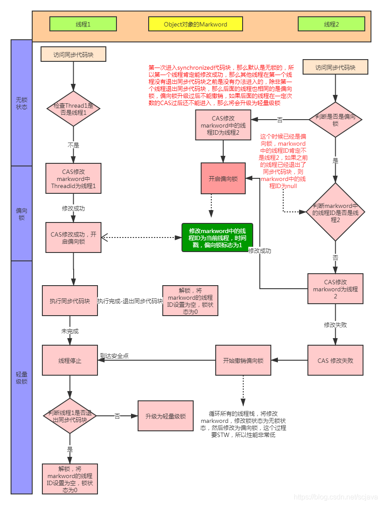

# JUC
## java多线程相关概念
### 1把锁
synchronized
### 2个并
1. 并行(parallel)
   * 概念：不同实体上的多个事件，多台处理器上同时处理多个任务，同一时刻，大家各做各的事情
   * 举例：泡面，一边烧水一边撕开包装
2. 并发(concurrent)
   * 概念：同一实体上的多个事件，在一台处理器上“同时”处理多个任务，同一时刻，其实只有一个事件在发生
   * 举例：抢票
### 3个程序
1. 进程
   * 概念：系统中每一个应用程序就是一个进程，每个进程有自己的内存空间和系统资源
2. 线程
   * 概念：轻量级进程，同一个进程会有1个或多个线程，是大多数操作系统进行时序调度的基本单元
3. 管程
   * 概念：monitor（监视器），也就是平时所说的锁
## CompletableFuture
### FutureTask
* 功能：异步并行计算
* 特点：多线程、有返回、异步任务
* 优点：异步多线程，充分利用cpu资源
* 缺点：
   1. get()阻塞线程，调用即会等待至结果出现
   2. isDone()轮询会造成cpu资源损失
### CompletionStage
* 功能：提供异步线程的多个方法，类似管道
### CompletableFuture创建的四个静态方法
1. `public static CompletableFuture<Void> runAsync(Runnable runnable)`
2. `public static CompletableFuture<Void> runAsync(Runnable runnable, Executor executor)`
3. `public static<U> CompletableFuture<U> supplyAsync(Supplier<U> supplier)`
4. `public static<U> CompletableFuture<U> supplyAsync(Supplier<U> supplier, Executor executor)`
### CompletableFuture常用API
#### .handle((v, e)
* 可以携带异常传递结果
#### thenRun、thenApply、thenAccept
1. `thenRun` A步骤与B步骤无关
2. `thenAccept` 执行完A，A返回，B无返回，B可以用A的数据 accept类似流的终结语句
3. `thenApply` 执行完A，与B结合返回值  apply类似流管道
#### applyToEither
* `future.applyToEither(future2, f - > {})` future与future2比较返回执行更快的任务结果为f
#### thenCombine
* `future.thenCombine(future2, (x, y) -> { return x + y; });`
  future与future2返回x,y结果进行结果结合，返回新的CompletableFuture对象
### 线程唤醒方法
1. 使用Object中的`wait()`方法让线程等待，`notify()`唤醒
2. 使用JUC包中的`await()`方法让线程等待，`signal()`唤醒
3. LockSupport类

## 锁
### 锁升级
* 无锁->偏向锁->轻量级锁->重量级锁
### 悲观锁
* 概念：认为使用资源时，一定有别的线程抢占资源，多用于写操作
* 常用方式：`synchronized`、`Lock`
* `synchromized`:
  1. 本质：实例锁
  2. 解释：一个对象有多个`synchromized`方法，某一时刻，只要有一个线程调用任一`synchronized`方法，其他线程只能等待。锁的对象是this
  3. 原理：
     1. 代码块锁 `javap -c */*.class`反编译看字节码由`monitorenter`和`monitorexit`实现锁功能
     2. 对象锁  `javap -v */*.class`查看字节码附加信息，有ACC_SYNCHRONIZED标识
     3. 类锁 有ACC_STATIC和ACC_SYNCHRONIZED标识
  4. 问答：为什么每一个对象都可以成为一个锁?<br/>底层c++创建对象时，会创建`objectMonitor()`，里面有`_owner`属性指向持有锁的对象
  * 锁升级
    * 偏向锁：MarkWord存储的是偏向线程的ID
    * 轻量锁：MarkWord存储的是指向线程栈中Lock Record【记录】的指针
    * 重量锁：MarkWord存储的是只想堆中的monitor对象的指针
* `static synchromized` 类锁，锁定类创建的所有对象
### 乐观锁
* 概念；认为使用资源时，不会有别的线程抢占资源，多用于读操作
* 常用方式：
  1. 版本号机制
  2. cas（compare and swap）算法
### 公平锁和非公平锁
* 定义：
  1. 公平锁：多个线程按照申请锁的顺序获取锁，类似排队买票<br/>
  `ReentrantLock lock = new ReentrantLock(true);`
  2. 非公平锁：多个线程并不按照申请锁的顺序获取锁，高并发下有可能造成优先级反转或者饥饿的状态（某个线程一直得不到锁）
  <br/> `ReentrantLock lock = new ReentrantLock();`<br/>`ReentrantLock lock = new ReentrantLock(false);`
* 问答
  1. 为什么有公平，非公平的设计？<br/> 恢复挂起的锁到真正锁的获取有时间差，非公平锁能够更充分利用cpu的时间片，尽量减少cpu空闲时间
  2. 什么时候用公平，用非公平？<br/>注重效率用非公平，注重业务吞吐量用公平
### 可重入锁（递归锁）
* 定义：同一个线程在外层方法获取锁的时候，在进入该线程的内层方法会自动获取锁（前提，锁对象是同一个对象），不会因为之前已经获取过还没释放而阻塞
* 类型：synchronized、ReentrantLock
### 死锁
* 定义：死锁是指两个或两个以上的进程在执行过程中，由于竞争资源或者由于彼此通信而造成的一种阻塞的现象，若无外力作用，它们都将无法推进下去。此时称系统处于死锁状态或系统产生了死锁，这些永远在互相等待的进程称为死锁进程。
* 产生原因：1.系统资源不足；2.进程推进顺序不对；3.资源分配不当
* 发现死锁方式：<br/>1.纯命令`jps -l`查看类进程号 `jstack 进程编号`打印死锁类；2.图形化 jconsole，在jdk包里面
### 偏向锁
* 定义：单线程竞争。当线程A第一次竞争到锁时，通过修改MarkWord中的偏向锁ID、偏向模式。如果不存在其他线程竞争，那么持有偏向锁的线程将永远不需要同步
* 作用：当一段同步代码块一直被同一个线程多次访问，由于只有一个线程，那么该线程后续访问时自动获得锁
* 理论：
  * 锁总是被第一个占用他的线程所拥有，这个线程是锁的偏向线程
  * 偏向线程一直持有锁，后续线程进入和退出加锁的同步代码块时，不需要再次加锁和释放锁，而是直接检查锁的MarkWord里放的是不是自己的线程ID
  * 如果相等，表示偏向锁偏向当前线程，不需要获得锁，无额外开销，提高了性能
  * 如果不等，表示发生了竞争，尝试使用CAS替换MarkWord中线程ID为新线程的ID
    * 竞争成功，表示之前线程不存在，MarkWord中线程ID为新线程的ID，锁不会升级，仍然为偏向锁
    * 竞争失败，可能升级为轻量锁，保证线程间公平竞争锁
* 注意点：偏向锁只有遇到其他线程尝试竞争偏向锁时，持有偏向锁的线程才会释放锁，线程不会主动释放锁
* jvm命令：
  * java `-XX:+PrintFlagsInitial | grep BiasedLock*`
  * `-XX:+UseBiasedLocking` 开启偏向锁
  * `-XX:-UseBiasedLocking` 关闭偏向锁
  * `-XX:BiasedLockingStartupDelay=0` 取消偏向锁开启延迟
* 偏向锁流程图
  * 
### 轻量锁
* 定义：多线程竞争，但是任意时刻只有一个线程竞争，不存在线程激烈竞争，也就没有线程阻塞
* 目的：在没有多线程竞争的前提下，通过CAS减少重量级锁使用操作系统互斥量产生的性能损耗，先自旋，不行再升级
* 升级时机：当关闭偏向锁功能或多线程竞争偏向锁升级为轻量锁
* 默认自旋升级次数：
  * java6之前 10次或者超过cpu核数一半
  * java6之后 自适应自旋锁
    * 根据：1. 同一个锁上一次自旋的时间； 2.拥有锁线程的状态
* jvm参数：
  * -XX:PreBlockSpin=10 修改轻量锁升级重量锁自旋次数
### 重量锁
* 原理：<br/>java中`synchronized`的重量锁，是基于进入和退出Monitor对象实现的。<br/>
在编译时会将同步块的开始位置插入`monitor enter`指令，在结束位置插入`monitor exit`指令。<br/>
当线程执行到`monitor enter`指令时，会尝试获取对象所对应的`Monitor所有权`，如果获取到了，即获得锁，会在`monitor`的`owner`中存放当前线程的id。<br/>
这样当前线程处于锁定状态，除非退出同步块，否则其他线程无法获取该`Monitor`。
### 问答
1. monitor与java对象以及线程如何关联?
   1. 如果一个java对象被某个线程锁住，则该java对象的Mark Word字段中LockWord只想monitor的起始地址
   2. Monitor的Owner字段会存放拥有相关联对象的线程id
### 锁过程
* 
* 
### 中断协商机制
* 定义：
  1. 调用线程`interrupt`方法，将活动的线程中断标志设置为true，再自己实现中断线程操作
     2. 如果线程处于阻塞状态（sleep，join，wait等），在别的线程调用当前线程的`interrupt`方法则会立刻退出阻塞状态，并抛出`InterruptedException`
* 实现：
    1. `public void interrupt()` 设置线程中断状态为true，发起一个协商而不会立刻停止线程
  2. `public static boolean interrupted()` 判断线程是否被中断并清楚当前中断状态
  3. `public boolean isInterrupted()` 判断当前线程是否被中断（通过检查中断标志位）
### LockSupport
#### 常用方法
1. `park()` 阻塞
2. `park(Thread)`阻塞
3. `unpark(Thread)` 唤醒，发放通行证（permit
#### 优点
1. 不必加锁
2. 可以先唤醒再等待
### JMM（java memory model） 
#### 出现背景
屏蔽掉各种硬件和操作系统的内存访问差异
#### 定义
JMM是一种抽象概念，并不真实存在，它仅仅描述一组规定或规范，通过这个规范定义了程序中（尤其多线程）<br/>
各个变量读写访问方式并决定一个线程对共享变量的写入时何时以及如何对另一个线程可见<br/>
关键技术点围绕多线程的`原子性`、`可见性`和`有序性`展开
#### 原则
多线程的`原子性`、`可见性`和`有序性`
#### 作用
1. 实现线程和主内存之间的抽象关系
2. 屏蔽各个`硬件平台`和`操作系统`的内存访问差异以实现在各种平台下都能达到一致的内存访问结果
#### JMM三大特性
1. 可见性
   * 定义：当一个线程修改了某一个共享变量的值，其他线程能`立刻`知道该变更,JMM规定了所有共享变量都在`主内存`中
   * 线程A --操作--> 本地内存A（共享变量的副本） --JMM控制（缓存一致性协议or总线程机制）--> 主内存（共享变量）
   * 系统主内存共享变量数据修改写入时机不确定，多线程下可能出现`脏读`，所以每个线程都有自己的`工作内存`（栈空间）
   * 主内存相当于白粥，不同的本地内存相当于甜粥，咸粥。。。
2. 原子性
   * 多个线程对于共享资源的唯一排他，在对一个资源修改时，不可以被打断
3. 有序性
   * 指令重排序：JVM能够根据cpu特性（cpu多级缓存系统、多核处理器等）适当的对机器指令进行重排序，使机器指令更符合cpu执行特性，最大限度发挥机器性能
   * 禁止指令重排序，即为有序性
#### happens-before原则
* 背景：在JMM中，如果一个操作执行的结果需要对另一个操作可见性，或者`代码重排序`，则必存在`happens-before`（先行发生）原则
* 作用：保证可见性和有序性
* 总原则：
  1. 可见：如果一个操作`happens-before`另一个操作，第一个操作的执行结果第二个操作可见，并且第一个操作要在第二个操作之前
  2. 重排序：如果重排序前后结果一致，则可以进行重排序操作 
* 八条原则：
  1. 次序规则： 先来后到，保证可见性
  2. 锁定规则： 时间上，针对锁，锁释放后才能再获取
  3. volatile变量规则： 时间上，保证可见性
  4. 传递规则 A->B->C 得出结果A先行于C
  5. 线程启动规则（Thread Start Rule） 线程先start才能执行线程内的逻辑操作
  6. 线程中断规则（Thread Interruption Rule） 先设置中断位置，才能检测到中断发生
  7. 线程终止规则（Thread Termination Rule） 线程中的所有操作发生在终止操作（`isAlice()`检测）之前
  8. 对象终结规则（Finalizer Rule） 一个对象初始化完成（构造函数执行结束）先行发生于他的`finalize()`（垃圾回收方法）的开始
#### volatile
* 特点：可见性、有序性
* 作用：
  1. 写一个`volatile`变量，JMM会把该线程对应的本地内存`立即`刷新到主内存
  2. 读一个`volatile`变量，JMM会把该线程对应的本地内存失效，重新读取主内存变量值
##### 实现：内存屏障
* 字节码指令：ACC_VOLATILE
* 作用：
  1. 内存屏障之前，所有写操作都要写到主内存
  2. 内存屏障之后，所有读操作都能获得内存屏障之前的所有写操作的最新结果（实现可见性）
* 实现步骤：java线程 ->  工作内存 ->  内存屏障 ->  主内存
* 粗分类
  1. 读屏障：读指令之前插入读屏障，工作内存和cpu高速缓存之中的缓存数据失效，重新到主内存获取最新数据<br/>`volatile读` --LoadLoad--> --LoadStore--> 普通读 普通写
  2. 写屏障：写指令之后插入写屏障，强制把写缓冲区的数据刷到主内存中<br/>普通读写 --StoreStore--> `volatile写` --StoreLoad--> 其他操作
  3. 全屏障， 读写屏障都有
* 细分类<br/> 
* |屏障类型 | 指令示例 | 说明                           |
  | :---- | :---- |:-----------------------------|
  |LoadLoad|Load1;LoadLoad;Load2| 保证Load1的读取操作在Load2以及后续操作之前执行 |
  |StoreStore|Store1;StoreStore;Store2|在Store2之后的写操作执行前，保证Store1的写操作已经刷新到主内存中|
  |LoadStore|Load1;LoadStore;Store2|在Store2及之后的写操作执行前，保证Load1的读操作已经读取结束|
  |StoreLoad|Store1;StoreLoad;Load2|保证Store1的写操作已刷新到主内存之后，Load2及之后的读操作才执行|
* volatile变量规则
* 
| 第1个操作 | 第2个操作-普通读写 |第2个操作-volatile读| 第2个操作-volatile写 |
|-------|------------| ---- |-----------------|
|普通读写|可重排|可重排| 不可重排            |
|volatile读|不可重排|不可重排| 不可重排             |
|volatile写|可重排|不可重排| 不可重排             |
* volatile读写过程<br/>`lock`[主]（锁定）->`read`[主线程]（读取）->`load`[工作内存]（加载）->`use`[工]（使用）<br/>--cpu-->`assign`[工]（赋值）->`write`[主]（写入）-> `unlock`[主]（解锁）
* num++ 不具备原子性，getfield iadd putfield
##### volatile实现禁重排
  * 重排序流程：源代码->编译器优化重排序->指令级并行重排序->内存系统重排序->最终执行的指令序列
  <br/>1.编译器优化重排序：编译器在不改变单线程串行语义的前提下，可以重新调整指令的执行顺序
<br/>2.指令级并行重排序：处理器使用指令级并行技术来将多条指令重叠执行，若不存在数据依赖性，处理器可以改变语句对应机器指令的执行顺序
<br/>3.内存系统重排序：处理器使用过程存在读/写缓冲区，这使得加载和存储操作看上去可能乱序执行
  * 数据依赖性：若两个操作访问同一变量，且这两个操作中有一个为写操作，此时这两个操作存在数据依赖性
##### volatile日常使用场景
1. 单一赋值场景（`volatile int a=1`,`volatile boolean flag=true`），复合运算不可以（`i++`）
2. 状态标志，判断业务是否结束
3. 开销较小的读，写用内部锁，多用于读多的场景
4. dcl双端锁的发布（单例模式）

### CAS
#### 定义
* 全称 CompareAndSwap
* 自旋定义：CAS有3个操作数，位置内存V，旧的预期值A，要修改的更新值B<br/>当且仅当旧的预期值A和内存值V相同时，将内存值修改为B，否则什么都不做或者重来，当它重来重试的这种行为称为--自旋
* CAS定义：CAS是jdk提供的非阻塞原子性操作，它通过硬件保证了比较-更新的原子性
* CAS底层：cpu原子指令--`cmpxchg`指令
#### Unsafe类
* 定义：是cas的核心类，可以使java直接访问底层系统，相当于一个后门
* 位置：jre/lib/rt.jar/sun/misc
* 
  ``` java
    public final int getAndAddInt(Object o, long offset, int delta) {
          int v;
          do {
              v = getIntVolatile(o, offset);
          // o对象，offset偏移量，v原值，v+delta修改值
          //比较原值与o所在offset值是否相等，相等true取反并更新
          } while (!weakCompareAndSetInt(o, offset, v, v + delta));
          return v;
      }
    ```
    
  * `while (!weakCompareAndSetInt(o, offset, v, v + delta))`底层
    ``` c++
      return Atomic::cmpxchg(x,addr,e) == e;
    ```
    ``` c++
    inline jint Atomic::cmoxchg(jint exchange_vale, volatile jint* dest, jint compare_value){
    //判断是否多核cpu
    int mp = os::is_MP();
    _asm{
      //三个mov指令表示将后面的值移动到前面的寄存器上
      mov edx, dest
      mov ecx, exchge_value
      mov eax, compare_value
      //cpu原语级别，cpu触发
      LOCK_IF_MP(mp)
      //cmpxchg:比较并交换指令
      //dword 全称double word表示两个字，四个字节
      //ptr 全称pointer，与dword连起来使用，表示访问的内存单元是一个双字节单元
      //将 eax寄存器中的值（compare_value）与edx双字节内存单元中的值进行比较
        cmpxchg dword ptr[edx], ecx
    }
    }
    ```
    
#### CAS缺点
* 循环时间开销大

* aba问题
1. 定义：线程1将值A提取A，挂起，线程2将值A提取，改为B，又改为A，线程1看到的还是A
2. 解决方法：版本号标记

### 原子操作类
#### 基本类型原子类
* AtomicInteger<br/>
常用方法：
  1. ` public final int get() //获取当前的值 `
  2. `public final int getAndSet(int newValue) //获取当前值，并设置新值`
  3. `public final int getAndIncrement() //获取当前值并自增`
  4. `public final int getAndDecrement() //获取当前值并自减`
  5. `public final int getAndAdd(int delta) //获取当前值并加上预期的值`
  6.  `public final boolean compareAndSet(int expectedValue, int newValue) //如果输入的数值等于预期值，则以原子方式将该值设置为输入值（newValue）`
* AtomicLong

* AtomicBoolean
#### 数组类型原子类
* AtomicIntegerArray

* AtomicLongArray

* AtomicReferenceArray
#### 引用类型原子类
* AtomicReference

* AtomicStampedReference
作用： 解决修改过几次
* AtomicMarkableReference
作用： 解决是否修改过

#### 对象的属性修改原子类理论
* AtomicIntegerFieldUpdater
作用：以一种线程安全的方式操作非线程安全对象内的某些字段
使用要求：<br/>
  1. 更新的对象属性必须用public volatile修饰
  2. 因为对象的属性修改类型原子类都是抽象类，所以每次使用都必须使用静态方法newUpdater()创建一个更新器，并且需要设置想要更新的类和属性
* AtomicLongFieldUpdater

* AtomicReferenceFieldUpdater

#### 原子操作增强类
* 学习方法：ab法则，before->after
* 思想：化整为零，分散热点
* LongAdder<br/>
  * 为什么计算块？
  1. 底层计算公式：`value = base + SUM(cell[i](o...i))`
  2. base变量：低并发，直接累加； cell[]数组，高并发，累加
     * `longAdder.increment();` 源码分析
       * ``` java
         /**
         * cs表示cells引用
         * b 表示获取的base值
         * v 表示期望值
         * m 表示cells数组的长度
         * c 表示当前线程命中的cell单元格
         * 1.最初无竞争时只更新base
         * 2.如果更新base失败后，首次创建一个cell[]数组
         * 3.当多个线程竞争同一个cell比较激烈时，可能就要对cell[]扩容
         */
         public void add(long x) {
             Cell[] cs; long b, v; int m; Cell c;
             //首次首线程((cs = cells) != null)一定是false，此时走casBase方式更新base值，且只有cas失败时，才会走入if中 (uncontended = c.cas(v = c.value, v + x))
             //条件1：cells不为空
             //条件2：cas操作casBase失败，说明其他线程先一步修改了base正在出现竞争
             if ((cs = cells) != null || !casBase(b = base, b + x)) {
                 int index = getProbe();
                 //contended竞争者，true无竞争，false表示竞争激烈，多个线程hash到同一个cell，可能要扩容
                 boolean uncontended = true;
                 //条件1：cells为空
                 //条件2：应该不会出现
                 //条件3：当前线程所在cell为空，说明当前线程还没更新过cell，应该初始化一个cell
                 //条件4：更新当前线程所在的cell失败，说明竞争激烈，多个线程hash到了同一个cell，需要扩容
                 if (cs == null || (m = cs.length - 1) < 0 ||
                     (c = cs[index & m]) == null ||
                     !(uncontended = c.cas(v = c.value, v + x)))
                     longAccumulate(x, null, uncontended, index);
             }
         }
         
       ```
  * `longAccumulate(x, null, uncontended, index);` 源码分析
  * ```java
    //long x需要增加的值，一般是1
    //LongBinaryOperator fn 一般传null
    //boolean wasUncontended 竞争标识，false代表有竞争，只有cells初始化之后，并且当前线程cas竞争失败才会是false
    final void longAccumulate(long x, LongBinaryOperator fn,
                              boolean wasUncontended, int index) {
        //如果index等于0，表明随机数还未初始化
        if (index == 0) {
            //ThreadLocalRandom为当前线程重新计算一个hash值，强制初始化
            ThreadLocalRandom.current(); // force initialization
            //重新获取probe值，hash值被充值，相当于一个新线程，所以设置wasUncontended为true
            index = getProbe();
            wasUncontended = true;
        }
        // collide 冲突，在这里表示扩容意向，true为想扩容
        for (boolean collide = false;;) {       // True if last slot nonempty
            Cell[] cs; Cell c; int n; long v;
            //CASE1：cells已经被初始化了
            if ((cs = cells) != null && (n = cs.length) > 0) {
                if ((c = cs[(n - 1) & index]) == null) { // 当前线程hash值运算后映射到cell单元为null，说明cell没有被使用
                    if (cellsBusy == 0) {       // Try to attach new Cell cell数组没有正在扩容
                        Cell r = new Cell(x);   // Optimistically create
                        if (cellsBusy == 0 && casCellsBusy()) { //尝试加锁，成功后cellsBusy==1
                            try {               // Recheck under lock
                                Cell[] rs; int m, j; //有锁情况下再判断一遍
                                if ((rs = cells) != null &&
                                    (m = rs.length) > 0 &&
                                    rs[j = (m - 1) & index] == null) { //将cell单元附到cells数组上
                                    rs[j] = r;
                                    break;
                                }
                            } finally {
                                cellsBusy = 0;
                            }
                            continue;           // Slot is now non-empty
                        }
                    }
                    collide = false;
                }
                else if (!wasUncontended)       // CAS already known to fail  竞争失败
                    wasUncontended = true;      // Continue after rehash   重新获取hash值，调用index = advanceProbe(index);
                else if (c.cas(v = c.value,
                               (fn == null) ? v + x : fn.applyAsLong(v, x))) //当前线程对应的数组中有了数据，并且重置过hash值，通过cas进行累加操作，x默认为1，cas成功跳出循环
                    break;
                else if (n >= NCPU || cells != cs)
                    collide = false;            // At max size or stale  n>=NCPU不可扩容，继续调用index = advanceProbe(index);
                else if (!collide)  //false表示想扩容且能扩容
                    collide = true;
                else if (cellsBusy == 0 && casCellsBusy()) {//当前cells数组和最先复制的cs数组是同一个，代表其他线程没有扩容过
                    try {
                        if (cells == cs)        // Expand table unless stale
                            cells = Arrays.copyOf(cs, n << 1); //左移1位，相当于*2
                    } finally {
                        cellsBusy = 0; //释放锁
                    }
                    collide = false; // 不想扩容
                    continue;                   // Retry with expanded table
                }
                index = advanceProbe(index);
            }
            //CASE2：cells没有加锁且没有初始化，则尝试对它加锁并初始化cells数组
            else if (cellsBusy == 0 && cells == cs && casCellsBusy()) {
                try {                           // Initialize table，扩容为2次幂
                    //double check 防止new cells数组时，上一个线程对应数组中的值被纂改
                    if (cells == cs) {
                        Cell[] rs = new Cell[2];
                        // index & table.length - 1
                        rs[index & 1] = new Cell(x);
                        cells = rs;
                        break;
                    }
                } finally {
                    cellsBusy = 0;
                }
            }
            //CASE3：cells正在初始化，则尝试在base上进行累加操作,兜底的
            // Fall back on using base
            else if (casBase(v = base,
                             (fn == null) ? v + x : fn.applyAsLong(v, x)))
                break;
        }
    }
    ```
    
  * 
* LongAccumulator

* DoubleAdder

* DoubleAccumulator

* Stripe64变量和方法定义：
  1. base：类似与AtomicLong中全局的value值。在没有竞争情况下数据直接累加到base上，或者cells扩容时，也需将数据写入到base上
  2. collide【冲突】：表示扩容意向。false一定不会扩容，true可能会扩容
  3. cellsBusy：初始化cells或者扩容cells需要获取锁，0：无锁状态；1：其他线程已经持有了锁
  4. casCellsBusy()：通过cas操作修改cellsBusy的值，cas成功表示获取锁，返回true
  5. NCPU：当前计算机cpu数量，cell数组扩容会用到
  6. getProbe()【probe调查打探】：获取当前线程的hash值
  7. advanceProbe()：重置当前线程的hash值

## ThreadLocal
### 定义
* ThredLocal提供线程局部变量，每一个线程在访问ThreadLocal实例的时候，都有自己独立初始化的变量副本
* ThreadLocal实例通常是私有静态字段，目的是将状态（用户id或者事务id）与线程相关联
### 问题
* 内存泄露：不再使用的对象或变量占用的内存不被回收
### 底层源码
* Thread<br/>
包含ThreadLocal
* ThreadLocal<br/>
有ThreadLocalMap内部静态类
* ThreadLocalMap<br/>
实质为以一个threadLocal为key，任意对象为value的Entry对象<br/>
两层包装
    1. `WeakReference<ThreadLocal<?>>`将`ThreadLocal对象`变成一个弱引用对象
    2. 定义一个`Entry`扩展`WeakReference<ThreadLocal<?>>`
* 三者关系
Thread相当于自然人，ThreadLocal身份证，ThreadLocalMap身份证信息
* java关系引用
  * 关系图<br/>
  * 
  * 强引用：普通对象，指向普通对象的引用变量，特点即使OMM也不会被回收，只有显示引用为null，才可被视为可回收
  * 软引用：
    * 实现：java.lang.ref.SoftReference
    * 特点：内存够用就保留，内存不够就回收
    * 应用场景：对内存敏感的场景，如高速缓存
  * 弱引用：
    * 实现：java.lang.ref.WeakReference
    * 特点：只要垃圾回收机制运行，不管jvm内存空间是否足够，都进行回收
    * 应用场景：读取本地图片,key路径，value弱引用图片内存 Map<String, WeakReference<BitMap>> imageCache = new HashMap<String, WeakReference<BitMap>>();
    * ThreadLocal为什么用弱引用：
      * 强引用ThreadLocal无法gc,会造成内存泄露
      * 弱引用ThreadLocal避免内存泄露，配合expungeStaleEntry(i);清除key为null的entry
      * 调用get,set,remove会尝试删除key为null的entry，释放value对象占用的内存
      * 线程池容易复用，value不容易置为null
  * 虚引用
    * 实现：java.lang.ref.PhantomReference
    * 特点：1.一个对象持有虚引用，则任何时候都可能被垃圾回收器回收；2.虚引用必须和引用队列（ReferenceQueue）联合使用
    * 应用场景：提供一种对象被回收后，做某些事情的通知机制，以实现更灵活的回收
### 总结
* 建议：
  * 使用static修饰：这个变量针对一个线程内所有操作共享，设置为静态变量，所有此类示例共享这一个静态变量，在类的第一次使用时装载，只分配一块内存空间，所有此类的对象（只要是这个线程内定义的）都可以操控这个变量
  * 自定义强制remove
  * 初始化
* 适用场景
  * 不解决线程共享数据问题
  * 适用于变量在线程间隔离，在方法间共享的场景
  * 每个线程都持有一个属于自己的专属map并维护了ThreadLocal对象与具体示例的映射，该map由于只被持有它的线程方法，所以不存在线程安全及锁的问题
  * 弱引用，避免了ThreadLocal对象无法被回收的问题
  * expungeStaleEntry安全加固，避免内存泄露

## 对象内存布局
### 对象构成元素
* 内部结构图
  * 
* 对象头（Header）
  * 对象标记【Mark Word】
    * 特点：根据对象的状态复用自己的存储空间，在运行期间MarkWord里存储的数据会随着锁标志位的变化而变化
    * 大小：8个字节
  * 类元信息（类型指针）【class pointer】
    * 定义：对象指向他的类元数据的指针，虚拟机通过这个指针确定对象属于哪个类
    * 大小：8个字节
  *  
  * 
  * 
  * markOop.hpp对象头注释
    * 
    * 1. hash：保存对象的哈希码 
      2. age：保存对象的年龄 4bit 最大为1111，所以有15次寿命，通过-XX:MaxTenuringThreshold（tenuring图灵、threshold门槛）可以修改
      3. biased_lock：偏向锁标识位
      4. lock：锁状态标识位
      5. javaThread*：保存持有偏向锁的线程ID
      6. epoch：保存偏向时间戳
  * 压缩指针
    * 开启方式：默认开启 -XX:+UseCompressedClassPointers
    * 命令：java -XX:+PrintCommandLineFlags -version 打印jvm相关设置
    * 作用：开启8+4+4（对齐填充）；关闭8+8 ，开启之后可以节省4字节的空间
    
  
* 实例数据（Instance Data）
  * 定义：存放类的属性（field）信息，包括父类的属性信息
* 对齐填充（Padding）
  * 作用：保证8个字节的倍数
  * 特点：虚拟机要求对象起始地址必须是8字节的整数倍，填充数据不是必须存在的，仅仅为了字节对齐部分内存按照8字节补充对齐

